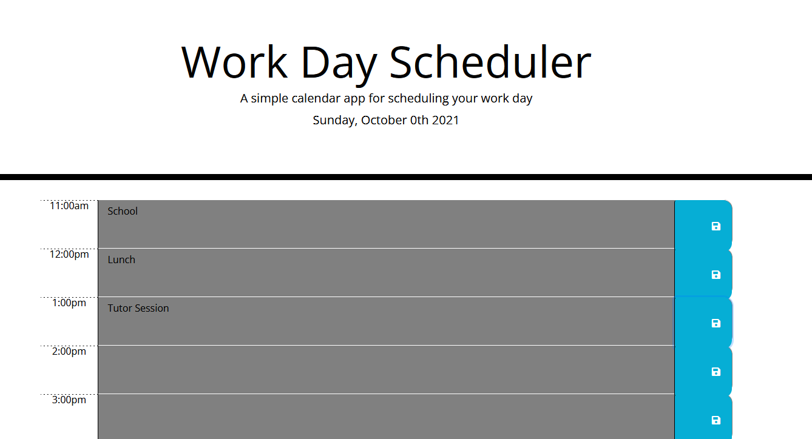

# work-day-scheduler

<!-- TABLE OF CONTENTS -->
<details open="open">
  <summary>Table of Contents</summary>
  <ol>
    <li>
      <a href="#about-the-project">About The Project</a>
      <ul>
        <li><a href="#built-with">Built With</a></li>
      </ul>
      <li><a href="#user-story">User Story</a>
    </li>
    <li>
      <a href="#links">Links</a>
    <li><a href="#screenshot">Screenshot</a></li>
  </ol>
</details>

## About The Project

This repository contains a calendar application that allows a user to save events for each hour of the day. The application runs in the browser and the HTML and CSS are dynamically updated by jQuery. The date/time library is updated by moment.js.

The user will enter events in the time bar, save the event with the save button, and the event will be stored in local storage even if the page is refreshed. The events are color coded based on the past, present, and future.

## User Story

```md
AS AN employee with a busy schedule
I WANT to add important events to a daily planner
SO THAT I can manage my time effectively
```

## Built With

- [HTML](https://html.spec.whatwg.org/)
- [CSS](https://www.w3.org/Style/CSS/Overview.en.html)
- [Javascript](https://www.javascript.com/)
- [JSON](https://www.json.org/json-en.html)
- [Moment.js](https://momentjs.com/)

## Links

- [Website](https://kimshihyun.github.io/work-day-scheduler/)
- [Github Repo](https://github.com/KimShiHyun/work-day-scheduler)

## Screenshot

The following image shows the web application's appearance and functionality:


